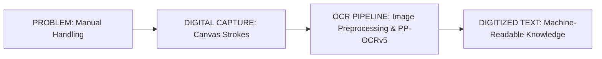
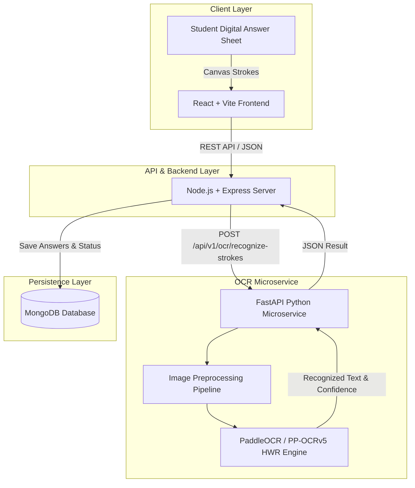

# SLIDE PRESENTATION DECK
## AI-Based Automated Answer Sheet Evaluation System
### Digital Handwriting Capture & Intelligent Text Digitization

**Target Audience:** Industry professionals, project evaluators, faculty, technical reviewers  
**Scope:** Milestone 1 — Digital Handwriting Capture → Preprocessing → PaddleOCR HWR Microservice → Machine-Readable Digitized Text. (Future LLM-based marking is detailed strictly in Slide 14 as Roadmap).

---

## SLIDE 1 — TITLE

### Slide Metadata
- **Slide Number:** 1 / 15
- **Slide Title:** AI-Based Automated Answer Sheet Evaluation System
- **Subtitle:** Digital Handwriting Capture & Intelligent Text Digitization
- **Theme:** Dark Enterprise Technology (Cyan / Blue Subtle Gradients)

### Content
- **Project Title:** AI-Based Automated Answer Sheet Evaluation System
- **Subtitle:** Digital Handwriting Capture & Intelligent Text Digitization
- **Metadata Details:**
  - **Team Members:** Student Development Team
  - **Project Guide:** Department Faculty Advisor
  - **Department:** Department of Computer Engineering / Software Engineering
  - **Organization / College:** Engineering & Technology Institute
  - **Academic Year:** 2025 – 2026

### Visual Design & Layout
- **Hero Diagram:**
  ```text
  ┌──────────────────────┐      ┌──────────────────────┐      ┌──────────────────────┐
  │  DIGITAL HANDWRITING │ ───► │       OCR / AI       │ ───► │    DIGITIZED TEXT    │
  │   Canvas Stroke Data │      │ PP-OCRv5 Microservice│      │ Machine-Readable Text│
  └──────────────────────┘      └──────────────────────┘      └──────────────────────┘
  ```
- **Presenter Notes:** Welcome evaluators and faculty. Today we present our engineering milestone on capturing digital student handwriting and transcribing it using PaddleOCR neural engine into structured machine-readable text.

---

## SLIDE 2 — EXECUTIVE SUMMARY

### Slide Metadata
- **Slide Number:** 2 / 15
- **Slide Title:** Project Overview
- **Layout:** 3-Column Glassmorphism Cards + Horizontal Workflow

### Content & Cards

#### 1. Problem
Manual handling and physical processing of handwritten answer sheets is time-consuming, prone to logistical delay, and difficult to convert automatically into machine-readable format.

#### 2. Solution
An end-to-end digital answer sheet capture platform paired with a high-throughput Python FastAPI microservice utilizing PaddleOCR (PP-OCRv5) for accurate handwriting recognition.

#### 3. Current Milestone
Direct transformation of student digital canvas strokes into structured, persistent, machine-readable text stored in MongoDB, forming the essential dataset for downstream evaluation.

### Workflow Visual


---

## SLIDE 3 — PROBLEM & BUSINESS NEED

### Slide Metadata
- **Slide Number:** 3 / 15
- **Slide Title:** Why Digitize Handwritten Answers?
- **Layout:** 2-Column Process Comparison (Traditional vs Proposed)

### Key Challenges Addressed
- Manual paper collection, sorting, and scanning overhead
- Unstructured handwritten text hindering computer-aided analysis
- Complexity in extracting question-specific student responses
- Error-prone manual data entry for evaluation tracking

### Process Comparison Table

| Phase | Traditional Process | Proposed System |
| :--- | :--- | :--- |
| **Input** | Physical Paper & Pen | Digital Tablet / Canvas Strokes |
| **Digitization** | Manual Scans / Physical Handling | Instant Rendered Image Pipeline |
| **Extraction** | Manual Human Reading | Automated PaddleOCR / PP-OCRv5 HWR |
| **Output Data** | Static Unstructured Images | Structured JSON / Machine-Readable Text |

**Core Impact:** Reduced manual data-entry dependency & seamless digital persistence.

---

## SLIDE 4 — PROPOSED SOLUTION

### Slide Metadata
- **Slide Number:** 4 / 15
- **Slide Title:** Proposed Solution Pipeline
- **Layout:** 6-Stage Horizontal Process Stepper Card Group

### 6-Stage Digital Pipeline
1. **01 — Student Writes:** Student writes answers directly using digital stylus/canvas interface.
2. **02 — Stroke Capture:** Vector coordinate strokes `(x, y, t)` captured per question.
3. **03 — Answer Image:** High-resolution PNG image dynamically generated from stroke vectors.
4. **04 — Preprocessing:** Contrast enhancement, grayscale thresholding, and noise reduction.
5. **05 — Handwriting Recognition:** PaddleOCR PP-OCRv5 neural model predicts handwritten text.
6. **06 — Digitized Text:** Extracted text normalized and persisted to MongoDB database.

**Key Statement:**  
> *“Transforming handwritten digital responses into structured, machine-readable text.”*

---

## SLIDE 5 — SYSTEM ARCHITECTURE

### Slide Metadata
- **Slide Number:** 5 / 15
- **Slide Title:** System Architecture
- **Layout:** Microservice Cloud/Enterprise Architecture Diagram

### Architectural Diagram


### Component Breakdown
- **Frontend:** React 19 + TypeScript + Vite (`localhost:5173`)
- **Backend Server:** Node.js + Express ESM + Mongoose (`localhost:5000`)
- **OCR Microservice:** Python 3.11 + FastAPI + PaddleOCR 3.7.0 (`127.0.0.1:8000`)
- **Database:** MongoDB Document Store (`AnswerSheet` collection)

---

## SLIDE 6 — END-TO-END OCR WORKFLOW

### Slide Metadata
- **Slide Number:** 6 / 15
- **Slide Title:** From Handwriting to Text
- **Layout:** 8-Step Vertical Process Workflow with Technical Callouts

### Step-by-Step Execution Flow
1. **Digital Canvas:** Interactive HTML5 Canvas records raw vector stroke sequences.
2. **Stroke Capture:** Coordinates grouped by `questionId` with precise stroke ordering.
3. **Image Generation:** Server side / service renders vector strokes into high-contrast bitmap.
4. **Preprocessing:** Upscaling, adaptive grayscale, and morphological noise filtering.
5. **Answer Segmentation:** Bounding boxes segmented for individual answer blocks.
6. **PaddleOCR Inference:** PP-OCRv5 mobile/server model executes neural character recognition.
7. **Text Extraction:** Raw text string & character bounding boxes extracted with confidence scores.
8. **Digitized Text Persistence:** Cleaned text populated into `extractedText` MongoDB field.

---

## SLIDE 7 — TECHNOLOGY STACK

### Slide Metadata
- **Slide Number:** 7 / 15
- **Slide Title:** Technology Stack
- **Layout:** 4-Category Tier Matrix with Badges

### Stack Tiers

```text
┌─────────────────────────────────────────────────────────────────────────┐
│ FRONTEND TIER                                                           │
│ React 19  │  Vite  │  TypeScript  │  HTML5 Canvas  │  Axios             │
├─────────────────────────────────────────────────────────────────────────┤
│ BACKEND TIER                                                            │
│ Node.js  │  Express.js  │  JWT Auth  │  Mongoose ODM                    │
├─────────────────────────────────────────────────────────────────────────┤
│ OCR & AI MICROSERVICE                                                   │
│ Python 3.11  │  FastAPI  │  PaddleOCR 3.7.0  │  PP-OCRv5  │ OpenCV       │
├─────────────────────────────────────────────────────────────────────────┤
│ DATABASE & INTEGRATION                                                  │
│ MongoDB  │  RESTful API Services  │  JSON Payloads                          │
└─────────────────────────────────────────────────────────────────────────┘
```

---

## SLIDE 8 — DIGITAL ANSWER CAPTURE

### Slide Metadata
- **Slide Number:** 8 / 15
- **Slide Title:** Digital Handwritten Answer Capture
- **Layout:** Split Screen — Interactive UI Mockup (Right) + 3 Process Stages (Left)

### Functional Callouts
- **01 — Write:** Students complete exams using digital pens on a responsive canvas.
- **02 — Capture:** Real-time capture of strokes, timing, and question assignment.
- **03 — Prepare:** Automatic compilation into image payloads ready for OCR microservice POST requests.

### UI Asset Link
- Screenshot: `presentation/assets/student_dash_screen.png`

---

## SLIDE 9 — IMAGE PREPROCESSING

### Slide Metadata
- **Slide Number:** 9 / 15
- **Slide Title:** OCR Image Preprocessing Pipeline
- **Layout:** Horizontal Stage Cards + Actual Debug Image Pipeline (`01` to `05`)

### Preprocessing Stage Details
- **Raw Render:** `01_original_canvas_render.png` — Rendered vector canvas strokes.
- **Resize / Upscale:** `02_upscaled.png` — Normalizes DPI and character stroke pixel thickness.
- **Grayscale Conversion:** `03_grayscale.png` — Removes color noise and converts to single-channel intensity.
- **Contrast Enhancement:** `04_contrast_enhanced.png` — CLAHE contrast stretching for handwriting clarity.
- **Final Thresholding:** `05_final_ocr_input.png` — Adaptive Otsu thresholding for crisp OCR input.

---

## SLIDE 10 — HANDWRITING RECOGNITION ENGINE

### Slide Metadata
- **Slide Number:** 10 / 15
- **Slide Title:** PaddleOCR-Based Handwriting Recognition
- **Layout:** Microservice REST Pipeline Diagram + Technical Highlights

### Microservice Flow
```text
[ Preprocessed Image PNG ]
            │
            ▼
[ FastAPI POST /api/v1/ocr/recognize-strokes ]
            │
            ▼
[ PaddleHWRProvider (PaddleOCR 3.7.0 / PP-OCRv5) ]
            │
            ▼
[ Extracted Text + Confidence Score (e.g. 0.6137) ]
            │
            ▼
[ JSON API Response to Node Server ]
```

### Key Technical Characteristics
- Asynchronous non-blocking background processing in Express service pipeline.
- Lazy model loading in Python FastAPI to prevent startup memory overhead.
- Direct stroke-to-text inference with per-answer confidence tracking.

---

## SLIDE 11 — CORE DEMONSTRATION

### Slide Metadata
- **Slide Number:** 11 / 15
- **Slide Title:** Core Demonstration: Handwritten Answer → Digitized Text
- **Layout:** Prominent 2-Column Transformation Spotlight

### Transformation Spotlight Layout
- **LEFT (INPUT):** Actual rendered student handwriting (`presentation/assets/generated_student_handwriting.png`).
- **CENTER:** Large Animated Processing Arrow `─── [ PaddleOCR PP-OCRv5 ] ───►`
- **RIGHT (OUTPUT):** Realized Extracted Text:
  ```text
  Extracted Text:
  "ADDLE OLR PERSISTENTE ("
  
  Status: Completed
  Avg Confidence: 61.37% (Medium)
  Provider: paddle 3.7.0
  ```

**Core Milestone Achievement:**  
> *“Handwritten digital responses converted into machine-readable digital text.”*

---

## SLIDE 12 — TECHNICAL OUTPUT

### Slide Metadata
- **Slide Number:** 12 / 15
- **Slide Title:** OCR API Output & MongoDB Record
- **Layout:** Syntax-Highlighted JSON Output + Field Explanation Card

### Real Microservice API JSON Output
```json
{
  "success": true,
  "message": "Handwriting recognition completed successfully.",
  "data": {
    "answerSheetId": "6a97c197883c3047ee452bed",
    "provider": "paddle",
    "executionTimeSec": 82.84,
    "overallConfidence": 0.6137,
    "extractedText": "Q1: ADDLE OLR PERSISTENTE (",
    "answers": [
      {
        "questionId": "q1",
        "recognizedText": "ADDLE OLR PERSISTENTE (",
        "hwrStatus": "Completed",
        "confidence": 0.6137,
        "confidenceLevel": "MEDIUM"
      }
    ]
  }
}
```

### Key Fields
- `extractedText`: Complete concatenated digitized text available for downstream consumers.
- `confidence`: Confidence score generated directly by PP-OCRv5 neural head.
- `hwrStatus`: Completion status flag for asynchronous client polling.

---

## SLIDE 13 — SYSTEM VALIDATION

### Slide Metadata
- **Slide Number:** 13 / 15
- **Slide Title:** OCR Pipeline Validation
- **Layout:** Validation Flow + Checklist & Application Screenshot (`manual_eval_screen.png`)

### Validation Criteria Verified

- [x] **API Availability:** FastAPI `/health` endpoint returns status 200 with active provider `paddle`.
- [x] **Stroke Rendering:** Canvas stroke JSON correctly synthesized into binary image files.
- [x] **Image Preprocessing:** 5-stage OpenCV pipeline executed with debug artifacts logged.
- [x] **HWR Execution:** Real PP-OCRv5 neural model executed without mock fallbacks.
- [x] **Database Persistence:** Mongoose `AnswerSheet` document populated with `ocrStatus: "completed"`.

---

## SLIDE 14 — CURRENT STATUS & ROADMAP

### Slide Metadata
- **Slide Number:** 14 / 15
- **Slide Title:** Current Status & Roadmap
- **Layout:** 2-Column Division: Completed Milestone (Left) vs Future Evaluation Phase (Right)

### Completed Milestone 1 (Current System Scope)
- [x] Digital Answer Stroke Capture
- [x] High-Resolution Image Generation
- [x] Contrast & Noise Preprocessing Pipeline
- [x] FastAPI PaddleOCR Integration
- [x] Real Neural Handwriting Recognition
- [x] Machine-Readable Text Digitization & MongoDB Persistence

### Next Phase (Future AI Evaluation — Out of Current Scope)
```text
┌─────────────────────────────────────────────────────────┐
│ NEXT PHASE — NOT PART OF CURRENT OCR MILESTONE          │
├─────────────────────────────────────────────────────────┤
│ Digitized Text                                          │
│       ↓                                                 │
│ Semantic Answer Understanding (LLM Prompting)           │
│       ↓                                                 │
│ Model Answer & Rubric Comparison                        │
│       ↓                                                 │
│ Automated Marking & Granular Feedback                   │
│       ↓                                                 │
│ Faculty Review & Override Interface                     │
└─────────────────────────────────────────────────────────┘
```

---

## SLIDE 15 — CONCLUSION

### Slide Metadata
- **Slide Number:** 15 / 15
- **Slide Title:** From Handwriting to Machine-Readable Text
- **Layout:** 3 Summary Pillars + Closing Statement

### Core Pillars
1. **Digital First:** Eliminates paper handling logjams by capturing student handwriting at source.
2. **Intelligent Digitization:** Leverages state-of-the-art PaddleOCR PP-OCRv5 microservice for offline HWR.
3. **AI-Ready Foundation:** Transforms raw handwriting into structured digital text ready for automated systems.

### Final Closing Statement
> **“From Digital Handwriting to Machine-Readable Knowledge.”**

---
*End of Presentation Deck Artifact.*
